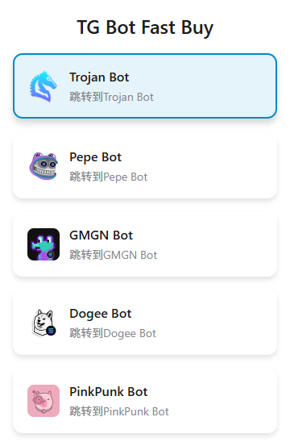
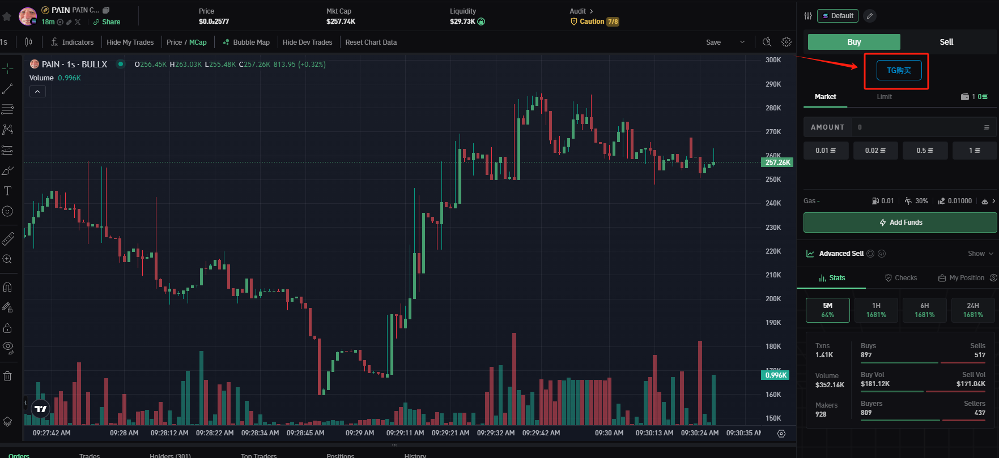
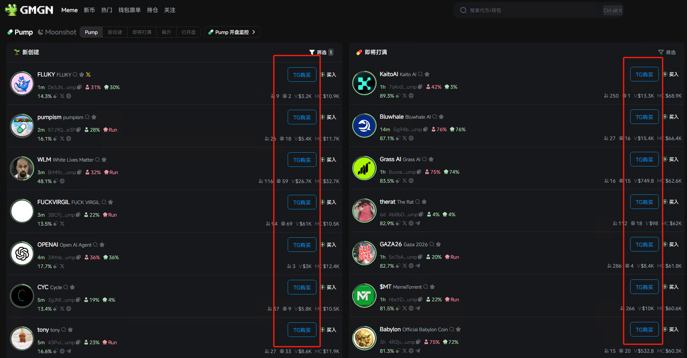
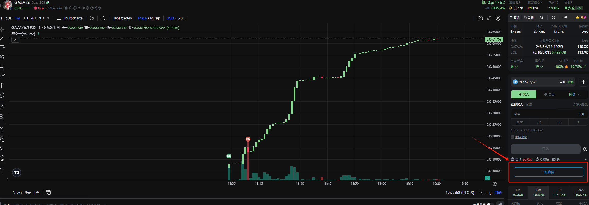
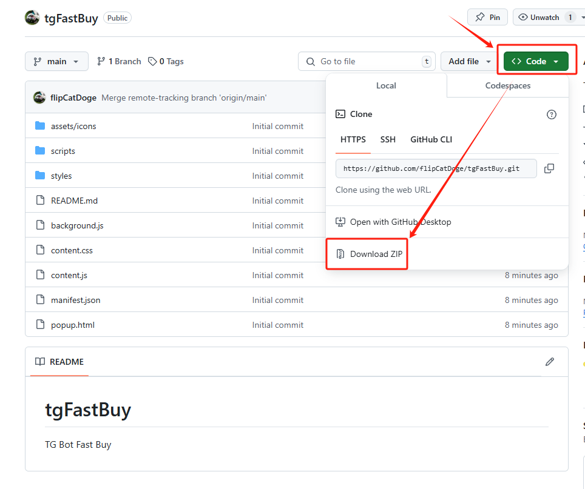
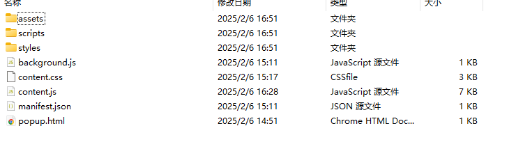

# 警告
务必阅读本源码，确保不会造成安全问题再进行使用。

## 功能说明
1. 自动传输ca消息到tg bot，弹出购买菜单；
2. 支持多个bot切换；
3. 目前仅支持bullx.io(公牛扫链)。

4. 添加了对GMGN的支持

5. 添加了对neo.bullx.io的支持

## 使用教程
1. 下载扩展文件夹，解压后将文件夹重命名为`tgFastBuy`

2. 安装扩展教程参考百度经验
[百度经验-直达链接](https://jingyan.baidu.com/article/148a19216b72900c70c3b176.html)
3. 使用教程参考推特视频
[视频链接](https://x.com/0xTechMelon/status/1887431384274510092)

## 注意事项
有任何疑问，欢迎推特留言